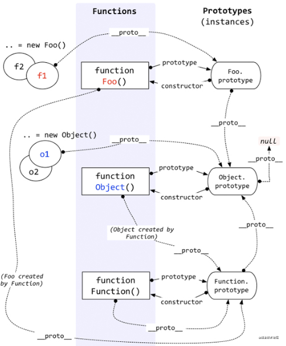

## 基础

```js
function Person(name, age) {
  this.name = name;
  this.age = age;
  this.eat = function () {};
}

let p = new Person("Tom", 1);
```

- 构造函数 funciton Person() {}
- 实例 const person = new Person()
- 原型 Person.prototype
- 隐藏属性 constructor
- `person.constructor === Person`
- `Person.prototype.constructor === Person`
- `person.__proto__ === Person.prototype`
- `Person.__proto__ === Function.prototype`
- `obj.__proto__ === Object.prototype`
- `foo.__proto__ === Object.prototype`
- `F.__proto__ === Function.prototype`
- `F.__proto__.__proto__ === Object.prototype`
- `实例对象.xxx -> 构造函数.prototype.xxx -> Object.prototype.xxx`

## 构造函数

> 当任意一个普通函数用于创建一个类对象时，它就被称作构造函数，或构造器。

- 默认函数首字母大写
- 通过 new 调用一个函数
- 构造函数返回的是一个对象

## new

```js
function myNew(constructor, ...args) {
  if (typeof constructor !== 'function') {
    throw 'constructor must be function'
  }
  const obj = Object.create(constructor.prototype)
  const res = constructor.call(obj, ...args)
  return typeof res === 'object' ? res : obj
}
```

### instanceOf

```js
function instanceOf(a, b) {
  if (typeof a !== 'object' || b === null) {
    return false
  }
  let photo = Object.getPrototypeOf(a)
  const prototype = b.prototype
  while (photo) {
    if (photo === prototype) {
      return true
    }
    photo = photo.__photo__;
  }
  return false;
} 
```
